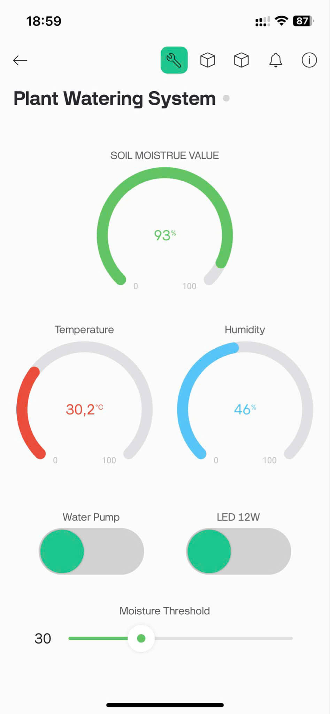
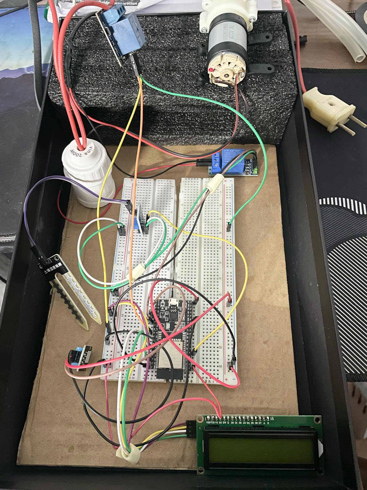

# 🌱 Hệ Thống Tưới Cây Thông Minh với ESP32, Blynk, DHT11 và ThingSpeak

## 📖 Giới thiệu

Đây là dự án tưới cây tự động sử dụng vi điều khiển **ESP32**, cảm biến **độ ẩm đất**, cảm biến **nhiệt độ và độ ẩm DHT11**, **màn hình LCD I2C**, kết nối **Blynk Cloud** để điều khiển từ xa, **ThingSpeak** để lưu trữ dữ liệu và (tùy chọn) **IFTTT** để gửi cảnh báo.

---

## 🔧 Phần Cứng Cần Thiết

| Thiết Bị                             | Số Lượng |
|-------------------------------------|----------|
| ESP32 Dev Board                     | 1        |
| Cảm biến độ ẩm đất                  | 1        |
| Cảm biến DHT11                      | 1        |
| Màn hình LCD I2C 16x2               | 1        |
| Relay module hoặc transistor        | 1        |
| Bơm mini 5V                         | 1        |
| Đèn LED (tùy chọn)                  | 1        |
| Dây nối, nguồn 5V                   | -        |

---

## 🧠 Sơ Đồ Kết Nối ESP32

| Thiết Bị              | Chân ESP32 đề xuất |
|-----------------------|--------------------|
| Soil Moisture Sensor  | GPIO34 (Analog)    |
| Cảm biến DHT11        | GPIO2              |
| Relay điều khiển bơm  | GPIO4              |
| Relay điều khiển LED  | GPIO5              |
| LCD I2C SDA           | GPIO21             |
| LCD I2C SCL           | GPIO22             |

---

## 📦 Cài Đặt Phần Mềm và Thư Viện

### 1. Cài đặt ESP32 trong Arduino IDE

- Mở **Arduino IDE**
- Vào **File → Preferences**
  - Dán vào mục *Additional Board Manager URLs*:
    ```
    https://raw.githubusercontent.com/espressif/arduino-esp32/gh-pages/package_esp32_index.json
    ```
- Vào **Tools → Board → Board Manager**, tìm “ESP32” và **cài đặt**

### 2. Cài đặt thư viện

Vào **Tools → Manage Libraries**, tìm và cài đặt:

| Tên Thư Viện                          | Mục Đích                         |
|--------------------------------------|----------------------------------|
| **Blynk** (by Volodymyr Shymanskyy)  | Kết nối ESP32 với Blynk Cloud    |
| **DHT sensor library by Adafruit**   | Đọc dữ liệu từ DHT11             |
| **LiquidCrystal_I2C**                | Điều khiển LCD I2C               |
| **HTTPClient** (có sẵn)              | Gửi dữ liệu lên Web APIs         |

---

## 🌐 Cấu Hình Dịch Vụ

### ☁️ Blynk Cloud

Đăng ký tài khoản tại: [https://blynk.cloud](https://blynk.cloud)

Tạo Template, lấy:

- `BLYNK_TEMPLATE_ID`
- `BLYNK_TEMPLATE_NAME`
- `BLYNK_AUTH_TOKEN`

Tạo các Datastreams:

| Virtual Pin | Tên               | Kiểu Dữ Liệu       |
|-------------|-------------------|--------------------|
| V0          | Soil Moisture     | Integer            |
| V1          | Pump Control      | Integer            |
| V2          | Light Control     | Integer            |
| V3          | Temperature       | Float              |
| V4          | Humidity          | Float              |
| V5          | Moisture Threshold| Integer/Slider     |

Cấu hình trong mã nguồn:

```cpp
#define BLYNK_TEMPLATE_ID "YourTemplateID"
#define BLYNK_TEMPLATE_NAME "YourTemplateName"
#define BLYNK_AUTH_TOKEN "YourBlynkAuthToken"

char ssid[] = "YourWiFiSSID";
char pass[] = "YourWiFiPassword";
```

### 📊 ThingSpeak

Đăng ký và tạo kênh tại: [https://thingspeak.com](https://thingspeak.com)

Lấy Write API Key, sử dụng trong mã như sau:

```cpp
String thingSpeakApiKey = "YourThingSpeakAPIKey";
String url = "https://api.thingspeak.com/update?api_key=" + thingSpeakApiKey + "&field1=" + moisture + "&field2=" + temperature + "&field3=" + humidity;
```

### 🔔 IFTTT (Tùy chọn)

Đăng ký tại: [https://ifttt.com](https://ifttt.com)

Tạo Applet:

- **Trigger**: Webhooks → Event name: `check_soil_moisture`
- **Action**: Email, Notification, v.v.

Lấy Webhook Key, cấu hình trong mã:

```cpp
String iftttKey = "YourIFTTTKey";
String url = "https://maker.ifttt.com/trigger/check_soil_moisture/with/key/" + iftttKey;
```

---

##   Khởi Tạo Các Biến Trong Mã

```cpp
#define DHTPIN 2
#define DHTTYPE DHT11
DHT dht(DHTPIN, DHTTYPE);

#define SOIL_MOISTURE_PIN 34
#define RELAY_PUMP_PIN 4
#define RELAY_LED_PIN 5

LiquidCrystal_I2C lcd(0x27, 16, 2);
```

---

## 🚀 Upload & Chạy

1. Mở **Arduino IDE**
2. Chọn board: **ESP32 Dev Module**
3. Chọn cổng COM phù hợp
4. Nhấn nút **Upload**
5. Mở **Serial Monitor** (baud 115200) để kiểm tra kết nối

**Quan sát**:

- Dữ liệu hiển thị trên màn hình LCD
- Blynk App / Web Dashboard
- Biểu đồ trên ThingSpeak
- (Tùy chọn) Email/Notification từ IFTTT

---


## ✅ Ghi Chú

- Đảm bảo ESP32 có kết nối WiFi ổn định
- Cảm biến đất nên được hiệu chỉnh theo loại đất thực tế
- Có thể thay thế DHT11 bằng DHT22 để tăng độ chính xác

---
## 📸Demo
<p align="center">
  
  
</p>

